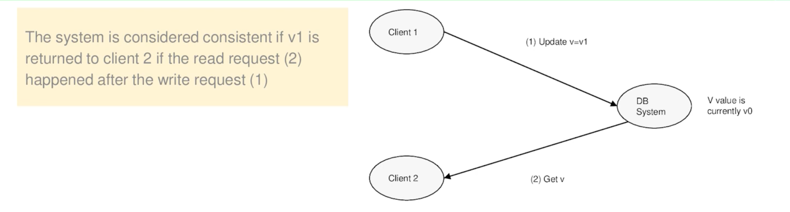
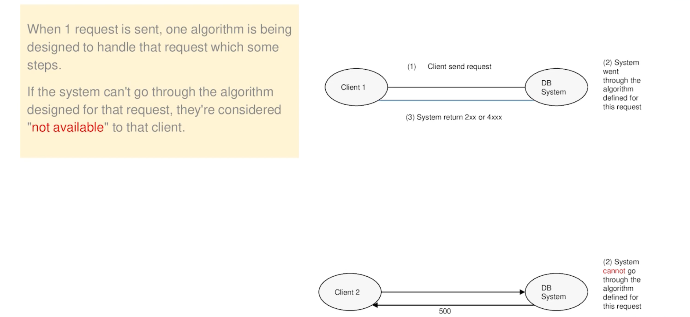
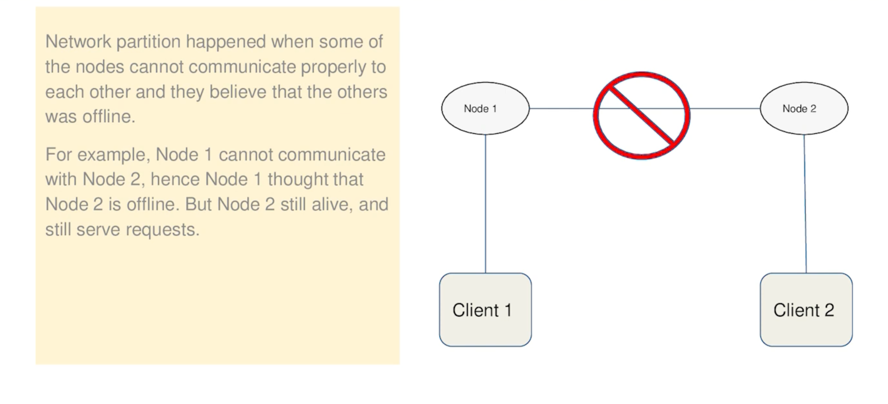

# Định nghĩa

Trade-off giữa C và A

Partition tolerance là một issue phát sinh

> Note: Bản chất cân bằng giữa C và A như thế nào khi mà Partition tolerance sảy ra ?

## Consistency

Trong ngữ cảnh của distributed system hay distributed system database mình sẽ hiểu nôm na là không thể không thay đổi mà nó thay đổi một cách có dự đoán.

## Availability

## Partition tolerance

