# Database

## Sự khác biệt giữa Count(\*) và Count(1)? Cái nào hiệu quả hơn?

1. Câu lệnh count nào sẽ có hiệu suất tốt nhất?

```
coun(*) = count(1) > count(primary key column) > count(column)
```

1.1. Count() là gì?

Count(arg) là một hàm tổng hợp, tham số của hàm count() là một cột, một hằng số hoặc thậm chí là (\*). Hàm được sử dụng để đếm số lượng bản ghi đáp ứng điều kiện truy vấn và tham số trong hàm count(arg) có giá trị khác null. Giả sử đối số hàm count là một trường như sau:

```sql
select count(name) from member;
```

Câu lệnh này là để đếm số lượng bản ghi trong bảng member với trường name không phải là null. Nói cách khác, nếu giá trị của trường name trong bản ghi là null, nó sẽ không được tính. Giả sử rằng tham số của hàm count() là hằng số 1, như sau:

```sql
select count(1) from member;
```

Tất nhiên 1 thì luôn khácnull rồi, vì vậy câu lệnh trên đếm có bao nhiêu bản ghi trong bảng member. Để hiểu rõ hơn, sau đây chúng ta cùng tìm hiểu các cơ chế hoạt động và chiến lược thực thi của hàm count nhé.

1.2. Count(primary key) hoạt động như thế nào?

Khi ta đếm có bao nhiêu bản ghi thông qua hàm count(arg), lúc này MySQL duy trì một biến gọi là count và đọc các record trong một lần duyệt. Nếu giá trị arg trong hàm count khác null, nó sẽ cộng thêm 1 vào biến count cho đến khi tất cả các bản ghi được duyệt và sau đó thoát khỏi lượt duyệt đó. Cuối cùng, trả về giá trị của biến count cho client.

Như chúng ta biết rằng sẽ có hai loại index là clustered index và secondary index. **Sự khác biệt giữa chúng là các nút lá của clustered index lưu trữ dữ liệu thực tế, trong khi các nút lá của secondary index chỉ lưu trữ giá trị khóa chính thay vì dữ liệu của bản ghi.** Mặc định clustered index sẽ được tự động tạo khi chúng ta tạo primary key và InnoDB sẽ lưu các bản ghi ở các nút lá của cây B+ Tree.

```sql
select count(CardNo) from member;
```

Nếu bảng chỉ có clustered index, không có second index, InnoDB sẽ duyệt trên clustered index. Mỗi bản ghi, InnoDB đọc giá trị primary key để so sánh với null. Nếu nó khác null, biến count sẽ được cộng thêm 1.


Ví dụ trường hợp khác, Phone_No là khoá chính và có tồn tại 1 second index trên (Phone_No, Name) trong bảng Member.


Tuy nhiên nếu có một secondary index trong bảng, InnoDB sẽ không duyệt clustered index, mà duyệt secondary index. Lý do là secondary index có thể chiếm ít dung lượng lưu trữ hơn so với clustered index => cây secondary index nhỏ hơn cây clustered index => chi phí I/O khi scan second index thấp hơn so với việc scan clustered index. Vì vậy optimizer ưu tiên dùng secondary index hơn.

1.3. Count(1) hoạt động như thế nào?

Trong trường hợp chỉ có clustered index và không có secondary index, InnoDB duyệt clustered index để đếm bản ghi, nhưng nó chỉ duyệt bản ghi, chứ không cần đọc lấy giá trị của primary key. Vì việc bản ghi có tồn tại được xem là khác null.

Ta có thể thấy, Count(1) sẽ nhanh hơn Count(primary key column), vì nó không cần đọc giá trị bản ghi để so sánh với null. Tuy nhiên, nếu có một secondary index trong bảng, InnoDB sẽ duyệt secondary index trước.

1.4. Count(\*) hoạt động như thế nào?

Khi bạn nhìn thấy ký tự \*, bạn có nghĩ rằng nó đang đọc tất cả các giá trị trường trong bản ghi không?

Nó sẽ đúng trong trường hợp select _, còn count(_) thì không nhé. **Khi chúng ta gọi count(\*), MySQL sẽ chuyển đổi tham số thành count(0).**


1.5. Count(column) hoạt động như thế nào?

```sql
select count(name) from member;
```

Đối với truy vấn này, MySQL quét toàn bộ bảng để đếm, vì vậy Count(column) có hiệu năng kém nhất so với count(1), count(\*) và count(primary key column).

Trong trường hợp column có secondary index thì câu lệnh sẽ sử dụng index để duyệt, từ đó tốc độ sẽ được cải thiện.

1.6. Tóm tắt

```sql
coun(*) = count(1) > count(primary key column) > count(column)
```

- Ưu tiên sử dụng coun(\*) hoặc count(1).
- Nếu có secondary index trong bảng, InnoDB sẽ chọn secondary index để duyệt. Vì nó hiệu quả hơn so với duyệt primary index.
- Nếu không có second index trên column X thì không nên sử dụng Count(column X) để đếm số lượng bản ghi, vì nó có thể scan toàn bộ bảng => kém hiệu quả nhất.

## Database indexing

Để hiểu về indexs, trước tiên cần hiểu ít nhất 6 data structures:

- Arrays
- Linked list
- Binary trế
- Binary search trees
- B-Trees
- B+ Trees

### Arrays

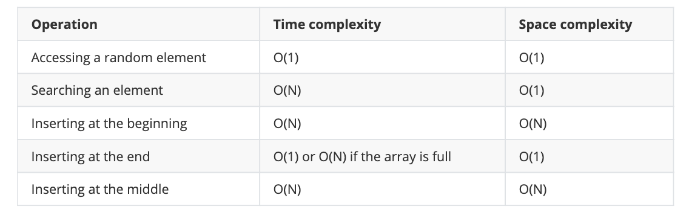

Array là một cấu trúc dữ liệu liền kề có kích thước cố định. Bản thân mảng là một con trỏ tới một địa chỉ bộ nhớ `x + (sizeof(t) * i)`:

- `x` là địa chỉ bộ nhớ đầu tiên mà mảng trỏ tới.
- `sizeof(t)` là kích thước của kiểu dữ liệu. Ví dụ: int chiếm 8 byte
- `i` là chỉ mục của phần tử hiện tại.

**Ví dụ**

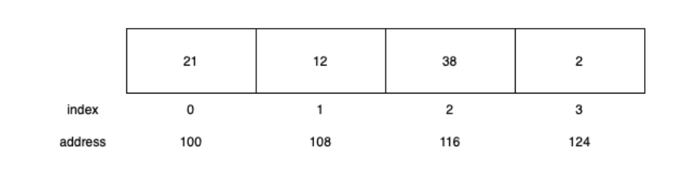

Địa chỉ bộ nhớ liên tiếp sau đó có một ý nghĩa thú vị: máy tính của bạn phải dịch chuyển các phần tử khi chèn hoặc xóa một mục. Đây là lý do tại sao việc thay đổi một mảng trong hầu hết các trường hợp là một thao tác O(n).

Vì nó là một cấu trúc dữ liệu tuyến tính với các phần tử và địa chỉ bộ nhớ liên tiếp nhau, việc tìm kiếm một phần tử cũng là một thao tác O(n). Bạn cần phải lặp qua tất cả các phần tử cho đến khi bạn tìm thấy thứ bạn cần. Tất nhiên, bạn có thể sử dụng tìm kiếm nhị phân nếu mảng được sắp xếp. `Tìm kiếm nhị phân` là một thao tác O(log N) và `quicksort` là một thao tác O(N \* log N). Vấn đề là bạn cần phải sắp xếp lại mảng mỗi lần bạn muốn tìm một phần tử. Hoặc bạn cần giữ cho nó được sắp xếp mọi lúc, điều này làm cho việc chèn và xóa trở nên tồi tệ hơn.

Điều mà mảng thực sự giỏi là truy cập các phần tử ngẫu nhiên. Đó là một thao tác O(1) vì tất cả những gì PHP cần làm là tính toán địa chỉ bộ nhớ dựa trên chỉ số.

Kết luận chính là việc tìm kiếm và thay đổi là chậm.

### Linked list

Vì mảng có hiệu suất kém khi chèn và xoá các phần tử, nên `linked list` đưa ra để giải quyết vấn đề này.

`Linked List` là tập hợp logic các phần tử ngẫu nhiên trong bộ nhớ. Chúng chỉ được kết nối thông qua con trỏ. Mõi mục có một con trỏ tới mục tiếp theo. Có một biến thể khác được gọi là `doubly linked list`.

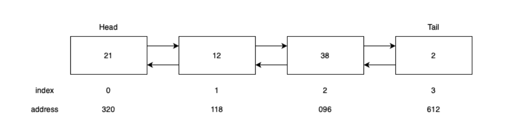

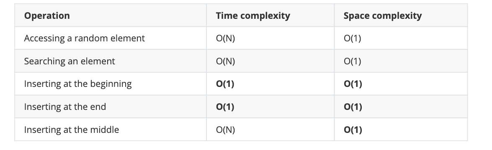

> However, searching is as slow as it was with arrays. It's still O(n).
> Martin Joo - Performance with Laravel
> No. 63 / 217

### Binary tree

Là tree mà số con của một node không quá 2 node.

- Mỗi node có đầy đủ 2 con thì gọi là cây nhị phân hoàn chỉnh.
- Nếu bỏ hết node ở độ cao h, ta thu được 1 cây hoàn chỉnh ( được gọi là cây nhị phân gần hoàn chỉnh)
- Tất cả các node con bên trái đề nhỏ hơn node hiện tại và tất cả các node con bên phải đều lớn hơn node hiện tại. (được gọi là Binary Search Tree - BST) - có yếu tố sắp xếp, tạo thuận lợi cho bài toán tìm kiếm.

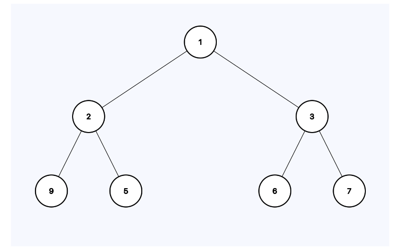

### Single-level indexing

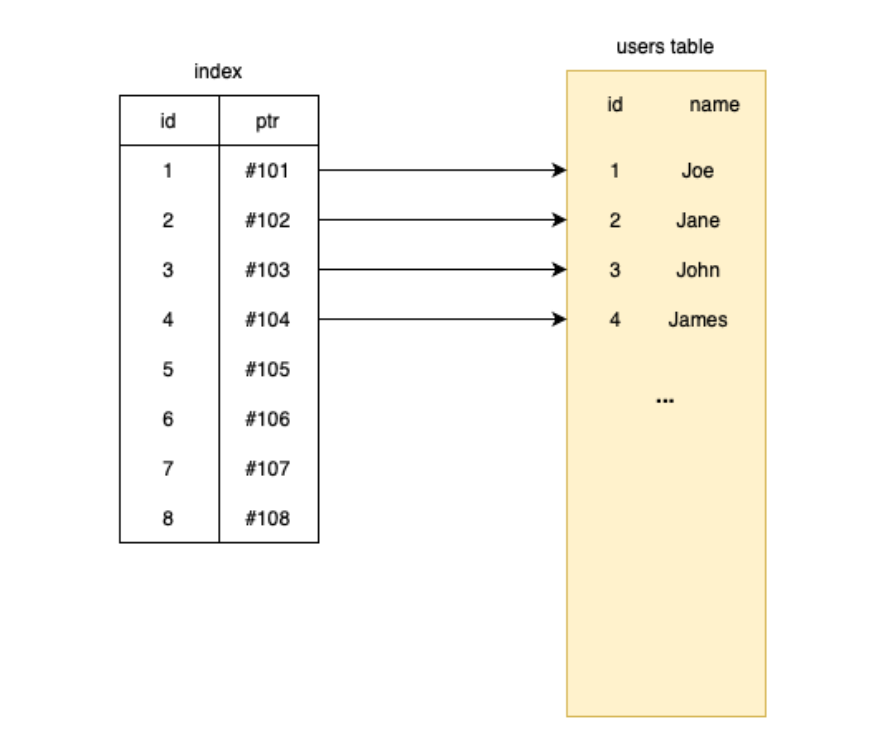

### Multi-level indexing

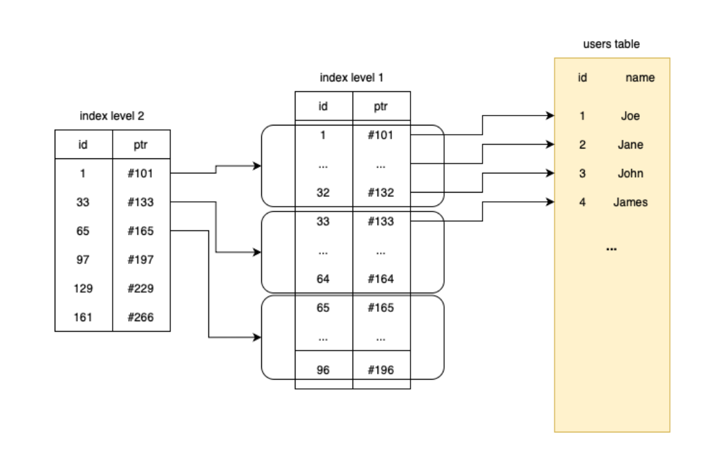

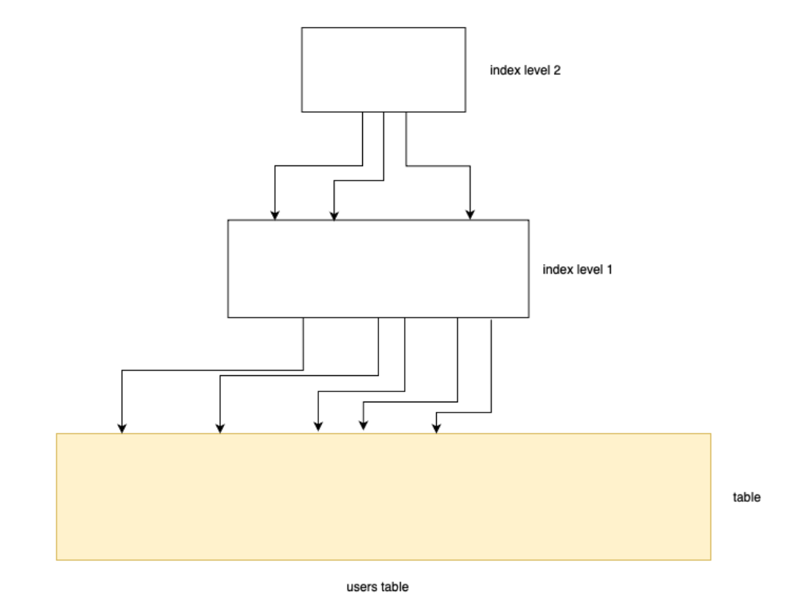

### Index access types

### const

```sql
select *
from users
where id = 1
```

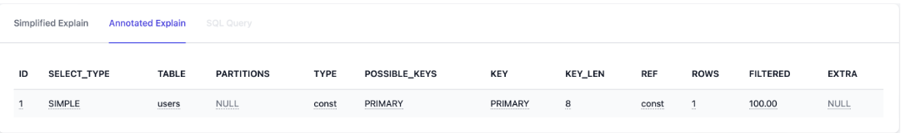

### range

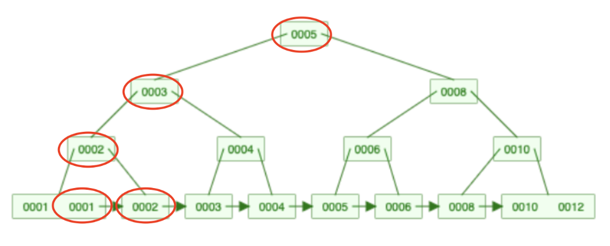

### index

```sql
select id
from users
where id != 1
```

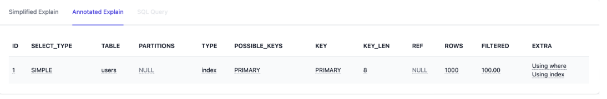

It's an index type. In this case, MySQL cannot identify a range or a single row that needs to be returned.
The best it can do is to scan the entire index. This sounds good, or at least better than a full table scan but
it's still an O(n) operation. Generally speaking, it's not that bad, however, it can cause problems if n (your
table) is large enough.

index queries also come in two flavors:

- When using index is present in the extra columns it's a bit better since at least MySQL doesn't need
  to perform extra I/O operations
- But when using index is not present it is generally speaking a slower query. According to MySQL it is
  as bad as a full table scan

### ALL

```sql
select first_name, last_name, job_title
from users
where first_name = "John"
```

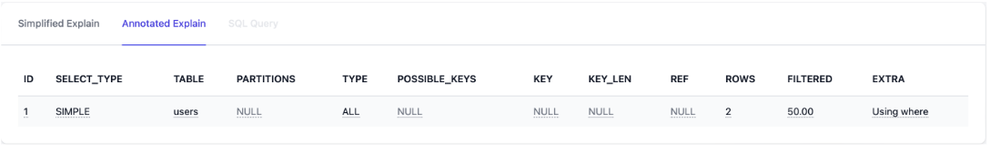

## Select \*

- **Index usage** nó ngăn chặn `optimizer` tối ưu hoá sử dụng các chỉ mục một cách hiệuq ủa.
- **Network traffic** MySql connections là một simple TCP connections. Khi quy xuất từng cột só với chỉ một vài cột, sự khác biệt có thể lớn về mặt kích thước khiến kết nốt TCP có thể nặng hơn và chậm hơn.
- **Resource consumption** Việc tìm nạp mọi thứ từ đĩa chỉ đơn giản là sử dụng nhiều CPU và bộ nhớ hơn. Trường hợp xấu nhất là khi bạn không cần tất cả dữ liệu và truy vấn (không có select \* ) có thể được cung cấp chỉ bằng chỉ mục.

## Stored Procedure vs Function

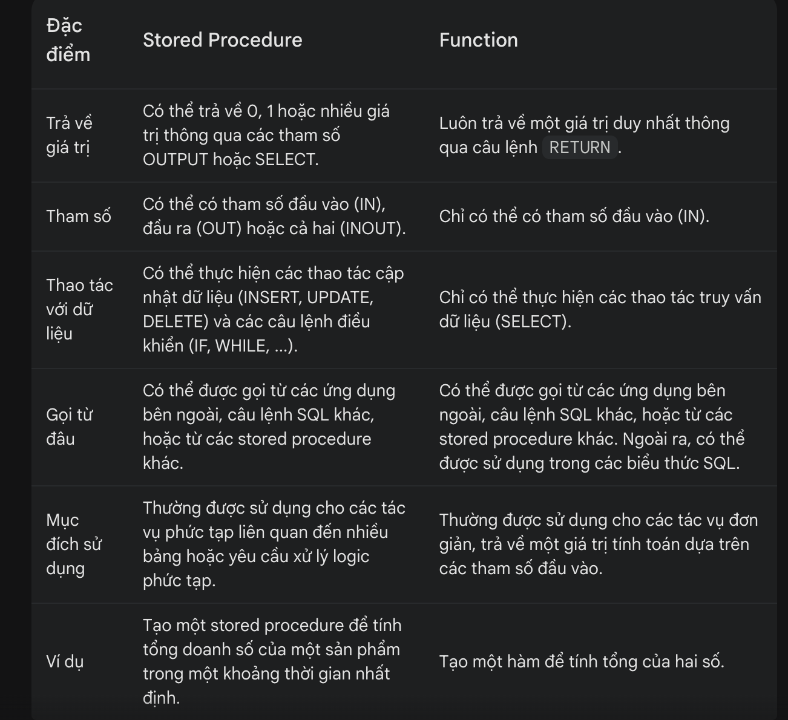

## Storage Engine trong mysql

