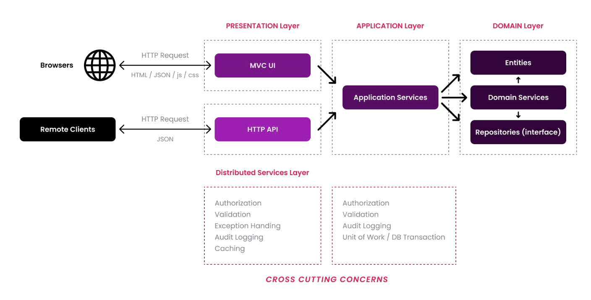

# DDD

DDD is suitable for **complex domains** and large-scale 
applications rather than simple CRUD applications. It focuses 
on the **core domain logic** rather than the infrastructure details. 
It helps to build a **flexible**, modular and **maintainable** code 
base

- **Domain.Shared** is the project that all other projects directly or indirectly depend on. So, all thetypes in this project are available to all projects.
- **Domain** only depends on the **Domain.Shared **because it is already a (shared) part of the domain. For example, an IssueType enum in the Domain.Shared can be used by an Issue entity in the Domain project.
- **Application service** depends on the Domain since the Application Services are implemented using the Domain Objects defined inside it
- **ViewModel**

### Database Provider / ORM Independence

Repository interfaces don't use any ORM specific objects.
1. To make your domain/application **infrastructure 
independent** since the infrastructure may change in the 
future or you may need to support a second database type 
later
2. To make your domain/application **focus on the business 
code** by hiding the infrastructure details behind the 
repositories
3. To make your **automated tests** easier since you can mock 
the repositories in this case.

### Presentation Technology Agnostic

> In some cases, you may need to have duplicate logic in the 
application and presentation layers. For example, you may need 
to duplicate the validation and authorization checks in both 
layers. The checks in the UI layer is mostly for user experience 
while checks in the application and domain layers are for 
security and data integrity. That's perfectly normal and 
necessary.

### Focus on the State Changes, Not Reporting

DDD focuses on how the domain objects **changes and 
interactions**; How to create an entity and change its properties by preserving the data **integrity/validity** and implementing the 
business rules.

### Để modeling các thực thể trong Domain-Driven Design (DDD), bạn có thể làm theo các bước sau:

- Xác định Bounded Contexts: Bounded Context là giới hạn trong đó một mô hình cụ thể có ý nghĩa. Việc đầu tiên là xác định các bounded context trong hệ thống.
- Định nghĩa Entities: Entities là các thực thể chính trong hệ thống. Một entity là một đối tượng có một số thuộc tính và phương thức.
- Xác định Value Objects: Value Objects là các thực thể không có tính nhất quán (Identity) và không thể thay thế.
- Xác định Aggregates: Aggregates là các nhóm các entities và value objects liên quan đến một nghiệp vụ cụ thể.
- Xác định Repositories: Repositories là nơi lưu trữ và truy xuất dữ liệu.
- Xác định Services: Services là các phần xử lý logic trong hệ thống.
- Xác định Events: Events là các sự kiện trong hệ thống.
- Xác định Value Objects: Value Objects là các thực thể không có tính nhất quán (Identity) và không thể thay thế.
- Xác định Aggregate Roots: Aggregate Roots là các entities chính trong các Aggregates.
- Xác định Invariants: Invariants là các quy tắc logic mà các entities phải tuân thủ.
- Xác định Business Rules: Business Rules là các quy tắc logic mà các entities phải tuân thủ.
- Xác định Domain Events: Domain Events là các sự kiện trong hệ thống.
- Xác định Domain Services: Domain Services là các phần xử lý logic cần truy cập đến nhiều domain khác trong hệ thống.

Invariants và Business Rules là hai khái niệm quan trọng trong lập trình và thiết kế phần mềm, đặc biệt là trong lĩnh vực phát triển phần mềm hướng đối tượng và thiết kế hệ thống. Dưới đây là sự phân biệt cơ bản giữa chúng:

#### Invariants (Ràng buộc bất biến)

- **Định nghĩa:** Invariants là những điều kiện luôn đúng trong suốt vòng đời của một đối tượng hoặc hệ thống. Nói cách khác, đây là những điều kiện không thay đổi từ khi đối tượng được tạo ra cho đến khi nó bị hủy.
- **Ví dụ:** Trong một hệ thống quản lý ngân hàng, số dư tài khoản không bao giờ được phép âm. Đây là một invariant của đối tượng tài khoản ngân hàng.
- **Mục đích:** Invariants giúp đảm bảo tính toàn vẹn và ổn định của dữ liệu trong phần mềm. Chúng được sử dụng để xác định các giới hạn và điều kiện mà đối tượng hệ thống phải tuân thủ.
  
#### Business Rules (Quy tắc kinh doanh)

- **Định nghĩa:** Business Rules là những quy định, chính sách, và quy tắc kinh doanh được áp dụng trong phần mềm để quản lý, hướng dẫn, hoặc điều chỉnh các hoạt động kinh doanh. Chúng có thể thay đổi theo thời gian tùy thuộc vào chiến lược kinh doanh.
- **Ví dụ:** Một quy tắc kinh doanh có thể quy định rằng khách hàng phải có ít nhất 18 tuổi để mở tài khoản ngân hàng. Quy tắc này có thể thay đổi nếu luật pháp hoặc chính sách công ty thay đổi.
- **Mục đích:** Business Rules được thiết kế để hỗ trợ và thực thi chiến lược kinh doanh, quản lý quy trình làm việc, và đáp ứng các yêu cầu pháp lý. Chúng giúp tổ chức duy trì sự linh hoạt trong hoạt động kinh doanh và dễ dàng điều chỉnh theo định hướng mới.
  
**Sự khác biệt cơ bản:**

- **Tính chất:** **Invariants** thường không thay đổi theo thời gian và phản ánh các điều kiện cốt lõi của hệ thống, trong khi Business Rules có thể thay đổi theo chiến lược kinh doanh và môi trường pháp lý.
- **Mục tiêu:** **Invariants** tập trung vào việc đảm bảo tính toàn vẹn và ổn định của dữ liệu, còn **Business Rules** tập trung vào việc hướng dẫn và điều chỉnh hoạt động kinh doanh.
Cả hai đều rất quan trọng trong việc thiết kế và phát triển phần mềm, nhưng chúng phục vụ cho các mục đích khác nhau và cần được hiểu và quản lý một cách phù hợp.
