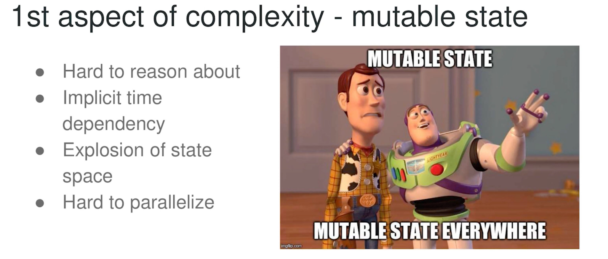
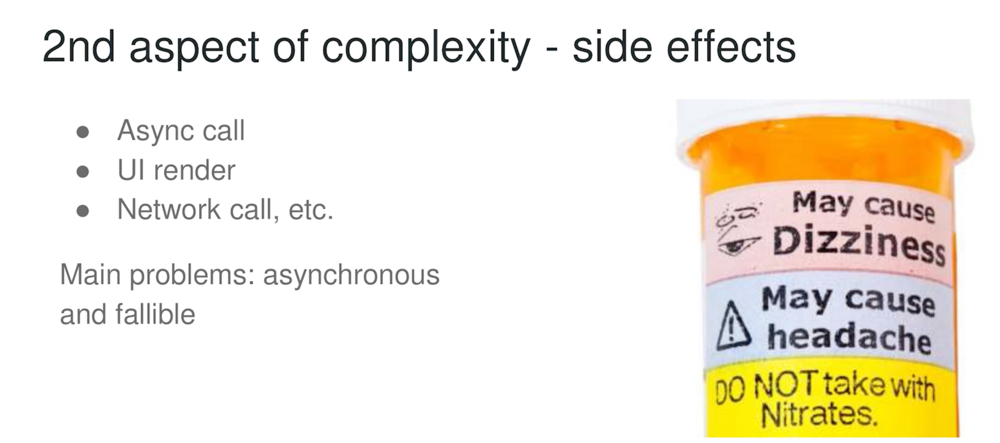
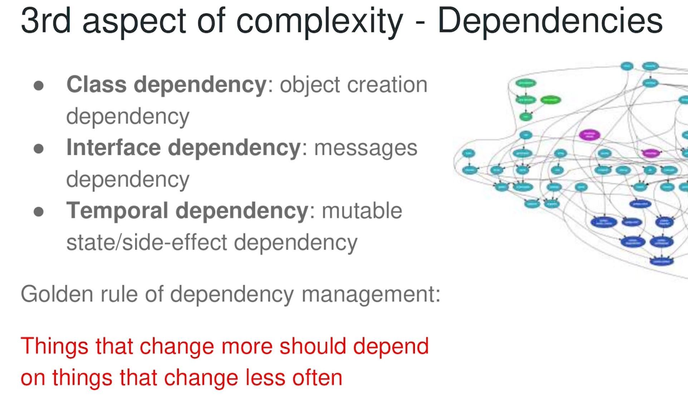
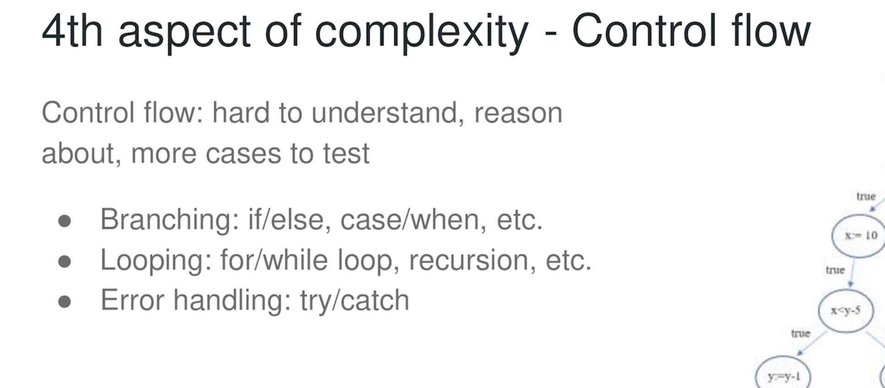
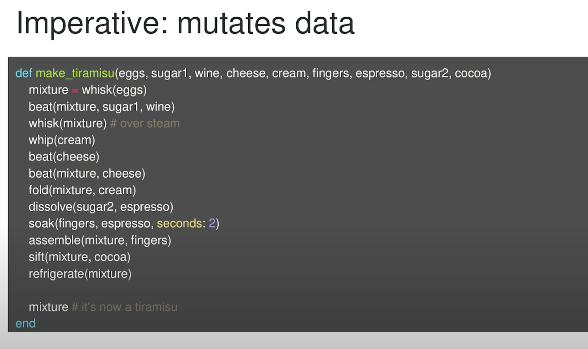
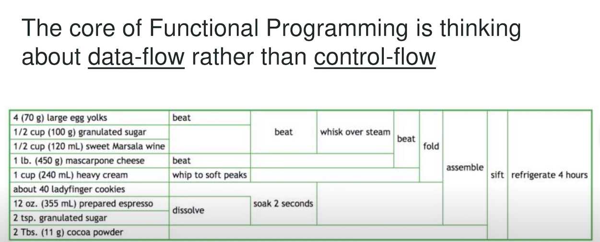

# Software Refactoring

OOP is not about class and inheritance.

"OOP to me means only messaging, local retention and protection and hiding of state-process, and extreme late-binding of all things." -- Alan Kay

- Message passing -> Interface is the only dependency between objects
- Local retention, protection and hiding of state-process -> Objects don't know the internal details of each other
- Extreme late-binding of all things -> Object behaviors can be changed at any point in time

No mention of class or inheritance at all!

## Software design is about cracking complexity

Writing software is complex...

**Two types of complexity:**
- Essential complexity
  - Complexity inherent to the problem which can't be removed e.g. Slack notification
- Accidental complexity
  - Complexity due to the choices made from a particular software design to solve the problem.

**5 aspects of complexity:**
- Shared mutable state
- Side-effects
- Dependencies
- Control flow
- Code size

**Two ways to manage complexity:**
- Reduce complexity
- Isolate complexity

> Note: OOP helps with isolating complexity

**OOP is isolates shared mutable state.**
- Objects don't mutate state of each other directly but send messages to each other instead.
  
**OOP is isolates dependencies.**
- Objects only depend on each other's interface, not implementation which generally changes more often.

**OOP isolate control flow**

- Objects' internal control flow are isolated from each other. External control flow is just about objects sending messages to each other.

- Branching can be converted to polymorphism and isolated to object creation phase.

**But OOP does not reduce complexity!**

OOP may even increase complexity!

The main problem with OOP is that it does not reduce global complexity, it just packages complexity into isolated, smaller boxes.

- Increase global complexity by adding indirection to behavior
  - Raw data is inherently less complex than objects with behavior
- Increase dependencies: Adding dependencies between objects
- Increase control flow: As the control flow now are the messages between
- Increase code size

## Seeking complexity reduction with functional programming

Functional programming helps reduce complexity.

## Summarizing

Object oriented programming makes code understandable by encapsulating (isolating) moving parts (complexity).

Functional programming makes code understandable by minimizing (reducing) moving parts