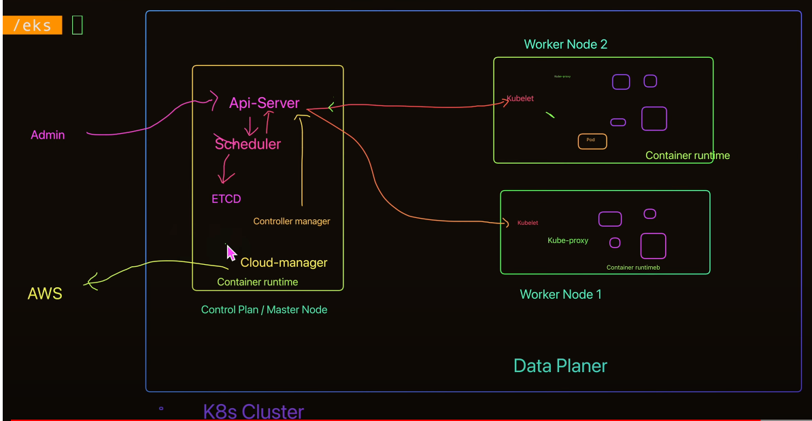

# Kubernetes Architecture

Kubernetes is a portable, extensible, open source platform for managing containerized workloads and services.

> "Portable" trong ngữ cảnh của Kubernetes nghĩa là có khả năng di chuyển, chạy hoặc triển khai trên nhiều môi trường khác nhau mà không cần phải thay đổi quá nhiều. Trong trường hợp của Kubernetes, nó có khả năng di động và có thể hoạt động trên nhiều hạ tầng khác nhau mà không yêu cầu sự điều chỉnh lớn.

_
High level Kubernetes architecture diagram showing a cluster with a master and two worker nodes
_

## Kubernetes cung cấp:

- Service discovery and load balancing
- Storage orchestration
- Automated rollouts and rollbacks
- Automatic bin packing
- Self-healing
- Secret and configuration management
- Batch execution
- Horizontal scaling
- IPv4/IPv6 dual-stack
- Designed for extensibility 

### Chu thich

- Ve mat ly thuyet co de deploy len ca master node (ko lam the)
- ETCD la csdl dang key - value, luu tru tat ca thong tin trang thai cua ung dung
- Kubelet chi lam nhiem bu deploy chi thi tu api-sever, gui cac ban report trang thai cua dich vu voi api-server
- Kuproxy quan ly giao tiep giua cac pod trong worker node

  