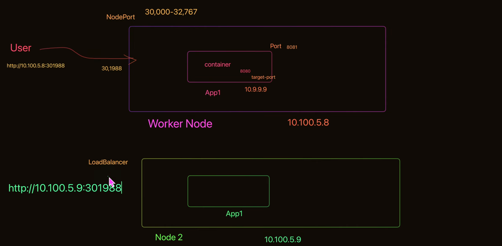

## POD

- List pod

```
kubectl get pods -w
```

- Run pod
```
kubectl run app1 --image=vietaws/arm:v1
```

- Truong hop luon yeu cau k8s le docker hub de pull image
```
kubectl run app1 --image=vietaws/arm:v1 --image-pull-policy Always
```

## Nodeport



```
kubectl expose pods app1 --port=8081 --target-port=8080 --name=service1 --type=NodePort
kubectl get nodes -o wide (xem chi tiet node pod)
```

- Xem logs

```
k logs app1 -f(watch log)
```

- Truong hop 1 pod co nhieu container
```
k logs app1 -c app1
```

- Exec pod
```
k exec -it app1 -- ls
```

